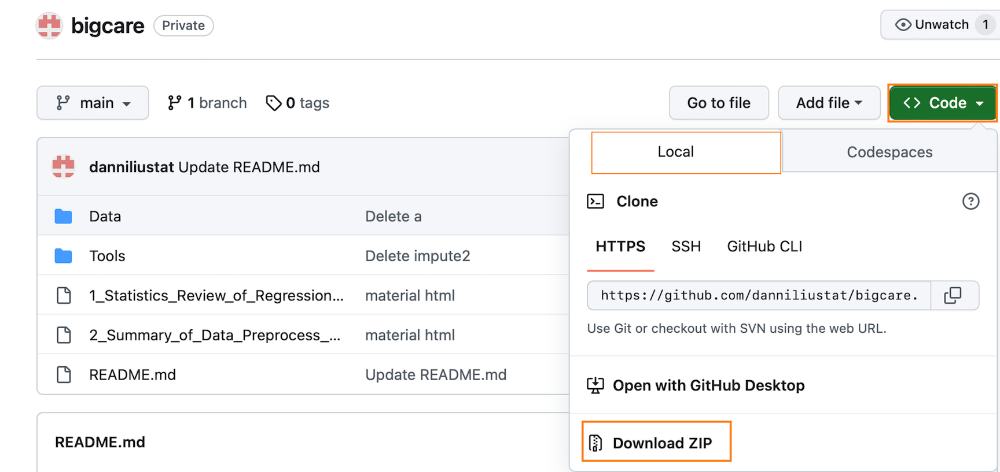

# bigcare
GWAS Workshop

This is repository is for CSHL 2023 Summer Course on GWAS analysis.

Speaker: Min Zhang, University of California, Irvine

Before you start, please download this whole repository to your personal laptop. Click "Code"-> Select "local" tab-> "Download ZIP". A ZIP file (likely with name "bigcare-main") will be saved to your laptop. Unzip the file to access all datasets and materials.

There are 5 HTML files
